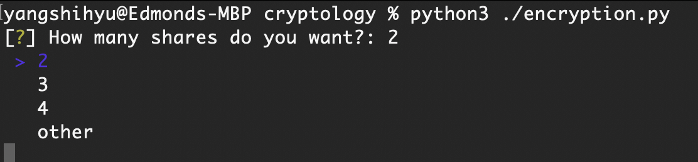
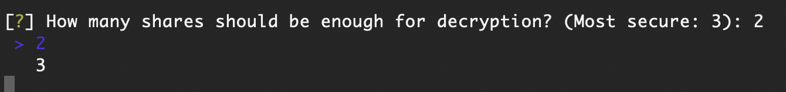
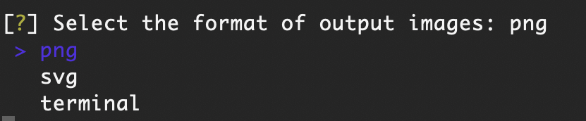
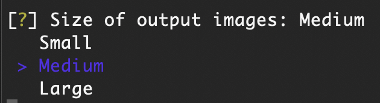
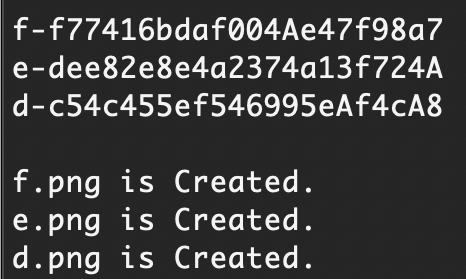
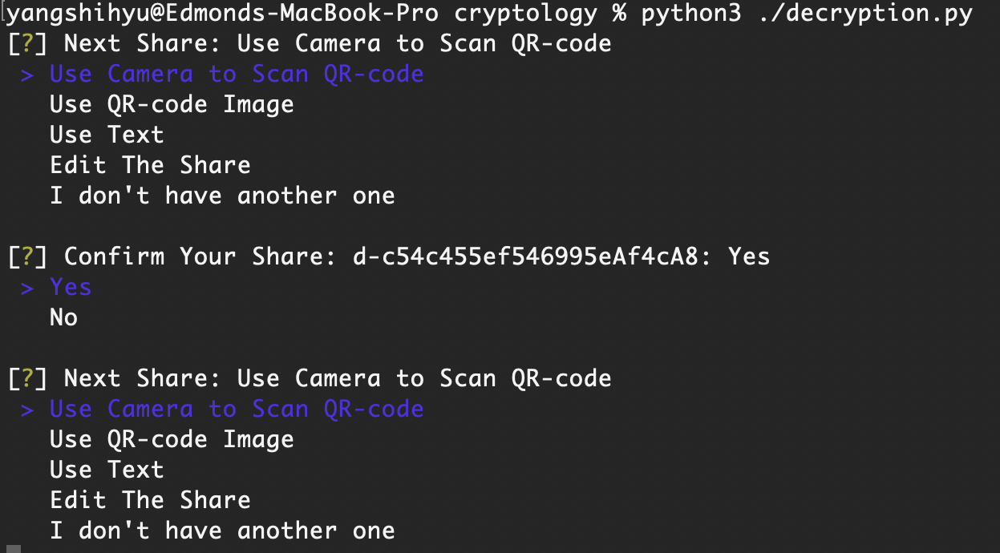
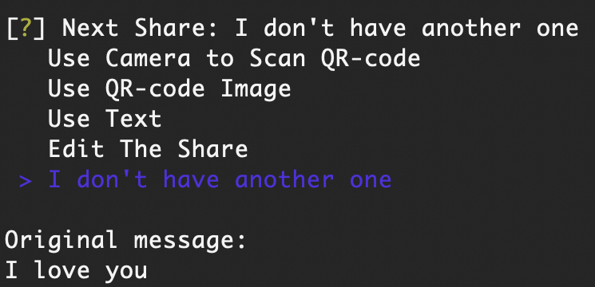

# 結合文字隱藏與 QR 碼技術以實現安全信息分享

本專題的動機在於探索和發展新型資訊隱藏技術，特別是結合快速反應碼（Quick Response Code, QR Code）的秘密分享機制。

QR Code 作為一種高效、可靠的二維條碼技術，已被廣泛應用於各種場合，而將其與秘密分享技術結合，可以進一步提升資訊傳遞的安全性。

## 檔案

| 檔名            | 檔案說明 |
|---------------| ------ |
| encryption.py | 用來加密的 python 檔案 |
| decryption.py | 用來解密的 python 檔案 |
| method.py     | 加密解密所需方法的檔案 |
| requirements.txt | 用來下載對應套件的檔案 |

## 執行步驟

### 環境設定

**Windows**

1. 執行 `pip3 install -r requirements`

**Linux**

1. 執行 `sudo apt install zbar`
2. 執行 `pip3 install -r ./requirements`

**MacOS**

1. 執行 `brew install zbar`
2. 執行 `pip3 install -r ./requirements`

### 加密訊息
1. 執行 `python3 encryption.py`
2. 看到問題 `How many shares do you want?`，選擇總共需要多少密文:  2、3、other (手動輸入)

3. 看到問題 `How many shares should be enough for decryption?`，選擇至少需要多少密文才能解密

4. 看到問題 `Select the format of output images`，選擇輸出 QR-code 的方式: png、svg、terminal

5. 看到問題 `Size of output images`，選擇 QR-code 大小: Small、Medium、Large

6. 看到問題 `Enter your message: `，輸入要隱藏的明文

7. 經過加密後，產生出密文，並儲存 QR-code 在該資料夾內

### 解密訊息
1. 執行 `python3 decryption.py`
2. 看到問題 `Next Share` 按照以下三種方式把一個一個將密文傳給程式，持續到 `STEP 3`: 
   1. 選擇 `Use Camera to Scan QR-code`，讓電腦（含攝像頭）掃描 QR-code 來取得密文，並確認其讀出的內容，按 `Yes`
   2. 選擇 `Use QR-code Image`，使用絕對/相對位置尋找 QR-code 圖片來取得密文，並確認其讀出的內容，按 `Yes`
   3. 選擇 `Use Text`，使用文字輸入密文
   4. 選擇 `Edit The Share`，支援刪除掉已經輸入的密文

3. 輸入完之後，選擇 `I don't have another one`，讓程式解密並輸出明文

